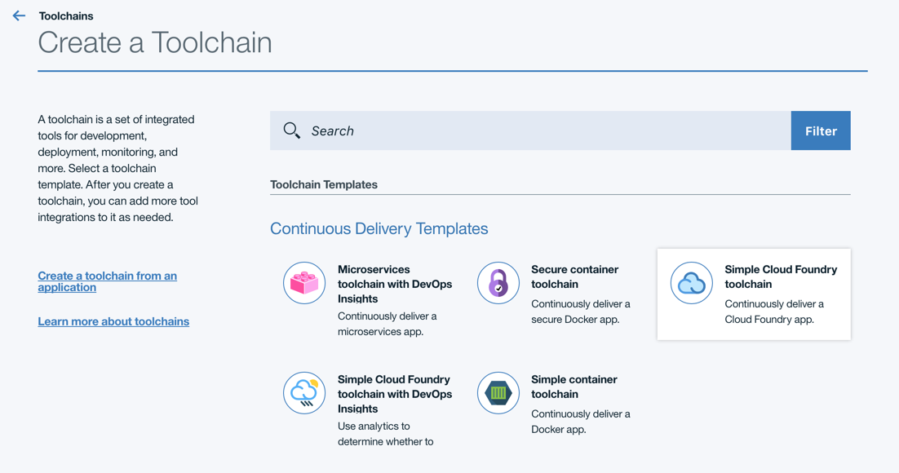
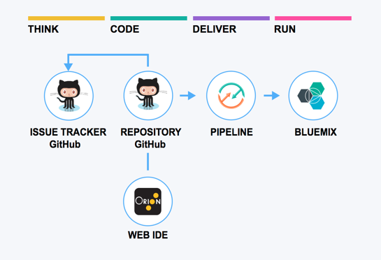
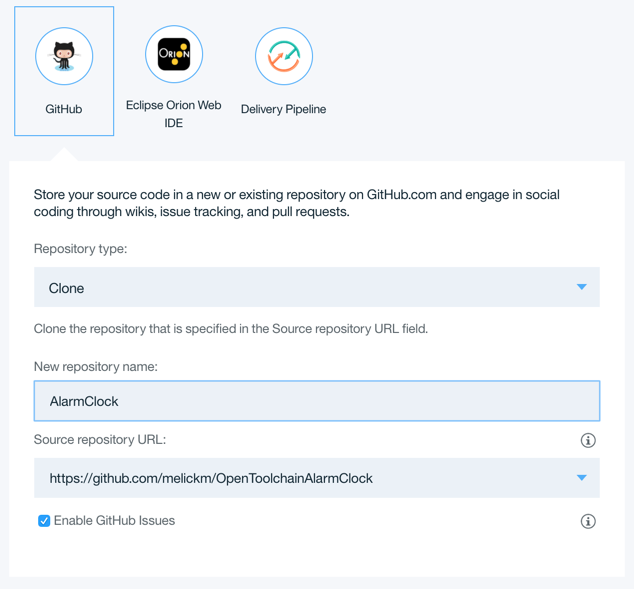
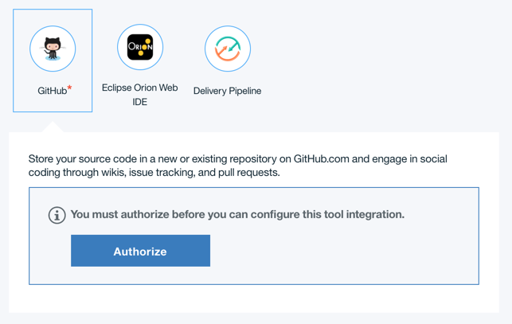
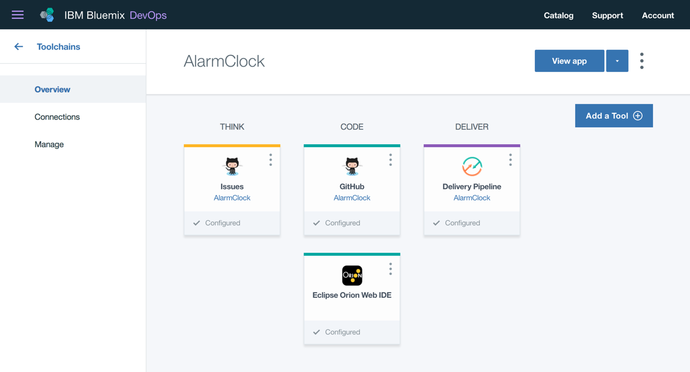
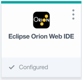

# OpenToolchainAlarmClock
In this lab, you'll create a simple toolchain that will enable to you iteratively deploy and alarm clock service to Bluemix.    

## Getting Started
Before getting started, you'll require a valid ID for Bluemix, GitHub.com and Twilio. Don't worry you can try them all for free!  If you don't have an existing ID, sign up for one by following the steps below:

### IBM Bluemix Account
1. Navigate to https://console.ng.bluemix.net/registration/ and sign up
1. As part of the Bluemix registration process, you will receive an email asking you to confirm your account.  If you do not confirm, you are not registered.  If you do not receive a confirmation email, send a note to [id@bluemix.net](mailto:id@bluemix.net).

### GitHub.com
1. Navigate to https://github.com and sign up.

### Twilio ID
1. Navigate to https://www.twilio.com/try-twilio?promo=bluemix and sign up.

## Setting up your development toolchain
To make things a bit easier there's some starter code in a GitHub repository. You'll create a toolchain with a copy of the code, a pipeline to build/deploy the code and even an editor to tinker with the code. Sounds like a lot of work? Not really. Just a few clicks and you'll be all setup.

1. Once logged into [Bluemix](https://console.ng.bluemix.net), you'll be presented with a different view depending on if you have any existing applications or not.  
1. From the hamburger menu near the top left of the screen click **Services** and the click **DevOps**.

  

  
1. The view will be slightly different depending on if you have any existing toolchains, but in either case click on **Create a toolchain** to continue.
1. Click on the **Simple Cloud Foundry toolchain** template. This template is a great way to get started when developing a simple Cloud Foundry app.

  
1. This template will create a toolchain with:
  - GitHub: Code repository and issue tracker.
  - Delivery Pipeline: Continuous build, test and deployment engine.
  - Eclipse Orion Web IDE: Code editor.
  - Bluemix: Deployment target.

  
1. Change the name of the toolchain to something more meaningful, like **AlarmClock**. Note: this name must be unique, so if you get a naming conflict, simply pick a new name.

  
1. When setting up GitHub you want to leverage the provided starter code.  
  1. Click on the GitHub icon and change the Source repository URL to: https://github.com/melickm/OpenToolchainAlarmClock

    
  - **Note:** If you haven't Authorized with Github.com, click the **Authorize** button and follow the instructions to authorize your Bluemix account to access your GitHub account.

    
1. Click **Create**. This is where the magic happens :)
  - The toolchain is created.
  - The starter code is cloned into your GitHub repository.
  - The delivery pipeline is created and triggered.
  - The toolchain is associated with your app.  
  - A trigger is added to the delivery pipeline, so when you push changes to the toolchain's GitHub repo, the delivery pipeline automatically builds and deploys the app.
1. The toolchain overview page will open with a card representation of each of the tools in the toolchain. In the next section, you'll use the tool cards to access the tools.  

  
## Uh oh!
1. From the toolchain overview page, click on the **Delivery Pipeline** card to see how your deployment is going.  The build was started automatically as part of the setup from the template.

  
1. There are two stages in this Delivery Pipeline.  
  - The first stage will pull the code from the GitHub repository to create a build. This is set to happen automatically on a commit, and you'll see this later in the lab.
  - The second stage will deploy the code to Bluemix to run your app.  But wait!  There was a problem with the deploy.  Notice the red banner indicating the stage failed.

    

## Let's fix it
1. Navigate back to the toolchain overview by clicking the back arrow

    
1. Click on the **Eclipse Orion Web IDE** tool card to get to the web editor

    
1. TODO add in steps for making the fix.
 - [ ] In the navigator select the file to edit
 - [ ] Make the necessary change
 - [ ] Commit the changes
 - [ ] Push the changes
 - [ ] Return to the toolchain

## Running Code!
1. Click on the **Delivery Pipeline** card in the toolchain overview to get back to the pipeline.
2. The commit will have started the build, and the deployment of the app automatically.
3. Once the application is deployed, the Deploy stage will turn green and a direct link to the running application will be available.  Click on it to get to your application.

## Set an alarm
- [ ] Explain how to use the app to set an alarm

## Disable an alarm
- [ ] Explain how to disable the alarm once sent
