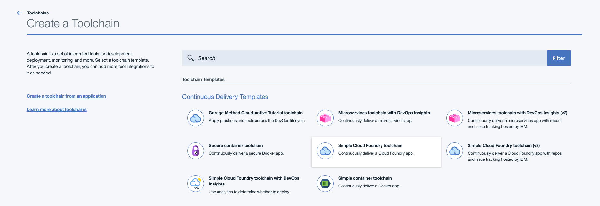
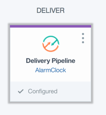

# OpenToolchainAlarmClock
This lab shows you how to create a toolchain from the Simple Cloud Foundry toolchain template and use the toolchain to continuously deliver an alarm clock application to IBM Bluemix.
You will:
- [Setup a toolchain](README.md#setting-up-your-development-toolchain)
- [Review the automated deploy](README.md#uh-oh)
- [Update the starter code](README.md#lets-fix-it)
- [Interact with the application](README.md#running-code)
- [Add an alarm](README.md#set-an-alarm)
- [Remove an alarm](README.md#disable-an-alarm)

## Getting Started
Before getting started, you will need to obtain a valid ID for Bluemix, GitHub.com and, optionally, IFTTT. Don't worry you can try them all for free!  If you don't have an existing ID, sign up for one by following the steps below:

### IBM Bluemix Account
1. Navigate to https://console.ng.bluemix.net/registration/ and sign up
1. As part of the Bluemix registration process, you will receive an email asking you to confirm your account.  You are not registered until you confirm your account.  If you do not receive a confirmation email, send a note to [id@bluemix.net](mailto:id@bluemix.net).

### GitHub.com
1. Navigate to https://github.com, review the [terms of service](https://help.github.com/articles/github-terms-of-service/), and, if you agree with the terms, create an account.
Note: You will not be able to complete the lab as described without a GitHub account.

### IFTTT
1. Navigate to https://ifttt.com, review the [terms of service](https://ifttt.com/terms), and, if you agree with the terms, create an account.
Note: You can still continue with the lab, if you do not create an IFTTT account.

#### Configuring IFTTT
IFTTT allows you to create an applet which will complete an action based on a trigger. To configure IFTTT to send a notification, such as an email or text message, complete the following steps:

1. Navigate to https://ifttt.com and choose **My Applets** from the navigation bar.
1. In the My Applets page, click **New Applet**.
1. In the statement `if +this then that`, click **+this**.
1. In the services selection page, enter `Maker Webhooks`, and select the Maker Webhook service. Maker Webhook can be used to receive a web request which will trigger an action.
1. If prompted, select `Connect`
1. Select the trigger `Receive a web request`.
1. Choose an event name, note the name down for later use, and click **Create trigger**.
1. The statement now reads `if maker then +that`, click **+that**.
1. In the services selection page, you will select the notification method when the alarm is activated. For example, to receive an email, select the Email service. Alternatively, to receive a text message, choose the SMS service.
1. Depending on the service select, apply the action.
1. Complete the action fields. You can choose to update the notification subject and body, or leave them as is. Click **Create action**.
1. Review the applet and click **Finish**.

#### Finding your IFTTT Maker key
The Maker key is used to uniquely identify your Maker service from someone else's.

1. Navigate to https://ifttt.com and choose Search from the navigation bar.
1. In the Search page, enter `Maker Webhooks` to filter for the Maker Webhook service. Click on the Maker Webhooks service.
1. In the top right of the page, click **Settings**.
1. Copy and navigate to the URL location.
1. The key is displayed. Note this value down for future use.

## Setting up your development toolchain
To make things a bit easier, you will use the starter code available in this GitHub repository. You will create a toolchain with a copy of the code, a pipeline to build and deploy the code, and even an editor to tinker with the code. Sounds like a lot of work? Not really! With just a few clicks, you will be all setup.

1. Begin by logging into [Bluemix](https://interconnectlabs.mybluemix.net/). Your view may differ, if you have existing applications.
1. From the hamburger menu near the top left of the screen click **Services** and then click **DevOps**.

  

  
1. The view will be slightly different depending on if you have any existing toolchains, but in either case click on **Create a toolchain** to continue.
1. Click on the **Simple Cloud Foundry toolchain** template. This template is a great way to get started when developing a simple Cloud Foundry app.

  
1. This template will create a toolchain with:
  - GitHub: Code repository and issue tracker.
  - Delivery Pipeline: Continuous build, test and deployment engine.
  - Eclipse Orion Web IDE: Code editor.
  - Bluemix: Deployment target.

  
1. Change the name of the toolchain to something more meaningful, like **AlarmClock**. Note: this name must be unique, so if you get a naming conflict, simply pick a new name.

  
1. When setting up GitHub, you want to leverage the provided starter code.  
  1. Click on the GitHub icon and change the Source repository URL to: https://github.com/melickm/OpenToolchainAlarmClock

    
  - **Note:** If you haven't Authorized with Github.com, click the **Authorize** button and follow the instructions to authorize your Bluemix account to access your GitHub account.

    
1. Click **Create**. This is where the magic happens :)
  - The toolchain is created.
  - The starter code is cloned into your GitHub repository.
  - The delivery pipeline is created and triggered.
  - The toolchain is associated with your app.  
  - A trigger is added to the delivery pipeline, so when you push changes to the toolchain's GitHub repo, the delivery pipeline automatically builds and deploys the app.
1. The toolchain overview page will open with a card representation of each of the tools in the toolchain. In the next section, you will use the tool cards to access the tools.  

  

## Uh oh!
1. From the toolchain overview page, click on the **Delivery Pipeline** card to see how your deployment is going.  The build was started automatically as part of the setup from the template.

  
1. There are two stages in this Delivery Pipeline.  
  - The first stage will pull the code from the GitHub repository to create a build. This is set to happen automatically on a commit, and you will see this later in the lab.
  - The second stage will deploy the code to Bluemix to run your app.  But wait!  There was a problem with the deploy.  Notice the red banner indicating the stage failed.

    

## Let's fix it
1. Navigate back to the toolchain overview by clicking the back arrow.

    
1. Click on the **Eclipse Orion Web IDE** tool card to get to the web editor.

    
1. In the web editor fix the issue.
 - [ ] In the navigator, expand AlarmClock, if it isn't already, and select the file to edit - manifest.yml
 - [ ] Update the host to a unique value (e.g. add the current time)
 - [ ] Click the **Git** icon in the left navigation
 - [ ] Enter a commit message and click **Commit** to commit the changes
 - [ ] In the Outgoing section, from the Push menu, choose **Push All** to push the changes
 - [ ] Return to the toolchain

## Running Code!
1. Click on the **Delivery Pipeline** card in the toolchain overview to get back to the pipeline.
2. The commit will have started the build, and the deployment of the app automatically.
3. Once the application is deployed, the Deploy stage will turn green and a direct link to the running application will be available.  Click on it to get to your application.

## Set an alarm
- [ ] In the application, enter the key and event (if you have configured IFTTT), a name for the alarm, and time for the alarm to go off (e.g. 10 seconds).

## Disable an alarm
There are two methods for disabling an alarm:

- [ ] In the application, navigate to all the alarms and choose to disable the alarm.
- [ ] In your notification (e.g. email or text message), click on the link to disable the alarm.

**Note:** In case of issues, to disable all alarms, stop the app.

[Scan this QR code](https://chart.googleapis.com/chart?chs=500x500&cht=qr&chl=QR235) and **go claim a T-Shirt** from the info desk!
